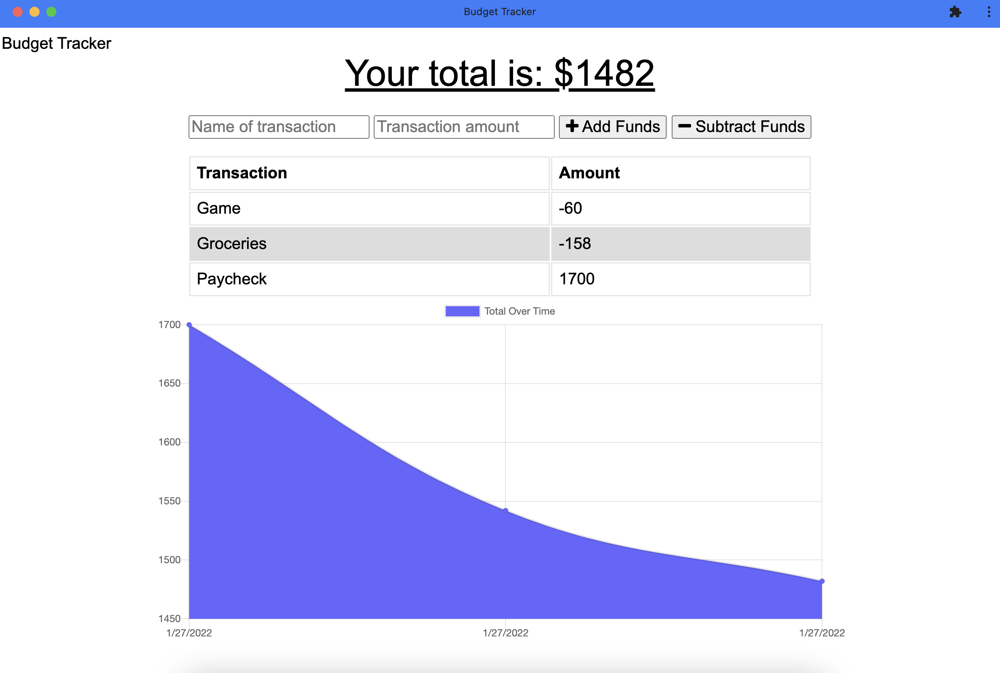

# Budget Tracker

## Description

Track funds online or offline with this progressive web app

## Table of Contents

1. [Usage](#Usage)

2. [Questions](#Questions)

3. [License](#License)

## Usage

Deployed App: [Budget Tracker](https://secret-wave-76054.herokuapp.com/)  
Enter the name of the transaction, the amount, and select whether to add or subtract from your budget. This app can also be downloaded as a PWA on smart phones and computers.

## Questions

GitHub profile: [HighDynamics](https://github.com/HighDynamics)  
Reach out with additional questions at <HighDynamics@gmail.com>

## License

Licensed under [MIT](https://opensource.org/licenses/MIT).

starter code by [Xandromus](https://github.com/Xandromus)  
forked repo [symmetrical-bassoon](https://github.com/coding-boot-camp/symmetrical-bassoon)
